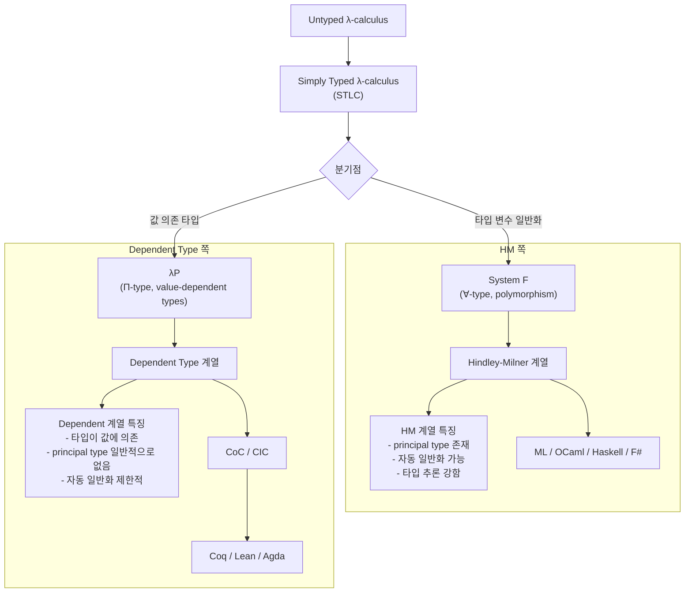

## 1.7 Additional Conveniences 그외의 편의기능

### 1.7.1 Automatic Implicit Parameters 자동 암시적 매개변수

타입 변수를 사용할때 lean이 암시적 매개변수로 처리해줌.

```lean
def length {α: Type} (xs: List α): Nat :=
  match xs with
  | [] => 0
  | y::ys => 1 + length ys

#check length -- length {\alpha: Type} (xs: List α) : Nat

def length' (xs: List α): Nat :=
  match xs with
  | [] => 0
  | y::ys => 1 + length' ys

#check  length' -- length'.{u_1} {\alpha: Type u_1} (xs: List α) : Nat
```

> - length는 α : Type 라고 직접 써서, 사실상 α : Type 0 에 가까운 형태로 고정됨
> - length'는 α를 따로 선언하지 않고 썼기 때문에, Lean이 자동 일반화(auto-bound implicit/generalization) 를 해서 α : Type u_1 형태의 유니버스 다형적 함수로 만듦

### 1.7.2 Pattern-Matching Definitions 패턴 매칭 정의

함수의 수행이 인자를 그대로 패턴매칭에 넣고 끝낼때 축약 가능

```lean
def length'' : (xs: List α) -> Nat
  | [] => 0
  | y::ys => 1 + length'' ys
```

```fsharp
// f# 에서도 비슷한 문법 존재
let filterNumbers =
    function | 1 | 2 | 3 -> printfn "Found 1, 2, or 3!"
             | a -> printfn "%d" a
```

- := 부분이 사라짐
- 함수 시그니처가 이름 (인자): 반환형 := 에서 이름: (인자) -> 반환형 으로 바뀜

```lean
-- 여러 인자를 패턴 매칭할 때
def drop : Nat -> List α -> List α
  | Nat.zero, xs => xs
  | _, [] => []
  | Nat.succ n, x::xs => drop n xs
```

패턴매칭 def는 명시적으로 이름이 없는 마지막 인자에 적용

```lean
def fromOption (default: α): Option α -> α
  | none => default
  | some x => x

#check fromOption -- fromOption {alpha: Type} -> Option \alpha -> alpha
#eval fromOption (some 5) (default := 0)
```

이 함수는 `Option.getD` 로 정의되어 있음
```lean
#eval (none).getD 0 -- 0
```

**주의 pattern matching def와 일반 def를 혼동해서 쓰면**

```lean
def confuseFn (x: String) (y: String) (z: String)
  | 0, _ => x
  | _, 0 => y
  | _, _ => z

#check confuseFn -- confuseFn (x: String) (y: String) (z: String) : Nat -> Nat -> String

#check confuseFn "left" "right" "neither" 0 0 
-- Nat -> Nat -> String
#eval confuseFn "left" "right" "neither" 5 5
-- "neither"

def confuseFn' (x: String) (y: String) (z: String) (n1: Nat) (n2: Nat): String :=
  match n1, n2 with
  | 0, _ => x
  | _, 0 => y
  | _, _ => z
```

### 1.7.3 Local Definitions 지역 정의

- 중간 계산 결과에 이름을 붙이려면 `let`
  - 의미 있는 중간 단계
  - 계산이 여러번 반복되는 경우

```lean
def unzip: List (α × β) -> List α × List β
  | [] => ([], [])
  | (x, y) :: xys => (x :: Prod.fst (unzip xys), y :: Prod.snd (unzip xys))

def unzip': List (α × β) -> List α × List β
  | [] => ([], [])
  | (x, y) :: xys =>
    let unzipped := unzip' xys
    (x :: unzipped.fst, y :: unzipped.snd)
```

- let도 패턴을 지원함

```lean
def unzip'': List (α × β) -> List α × List β
  | [] => ([], [])
  | (x, y) :: xys =>
    let (xs, ys) := unzip'' xys
    (x :: xs, y :: ys)
```

- 한줄에 여러번 사용하려면 ; 로 구분

```lean
def useLets (_: Unit): Nat :=
  let a := 1
  let b := 2
  let (c, d) := (4, 5)
  -- let e, f := (6, 7) error
  let g := 8; let h := 9
  a + b + c + d + g + h

#eval useLets ()
```

- 재귀 지역 함수는 let rec를 써야 함
- def는 rec 쓸 필요 없음

```lean
def reverse (xs: List α): List α :=
  let rec helper: List α -> List α -> List α
    | [], acc => acc
    | y::ys, acc => helper ys (y::acc)

  helper xs []
```

### 1.7.4 Type Inference 타입 추론

- Lean은 많은 경우 타입을 자동으로 추론
- 그래서 def와 let에서 타입 주석을 생략할 수 있는 경우가 많다.

```lean
def unzip': List (α × β) -> List α × List β
  | [] => ([], [])
  | (x, y) :: xys =>
    let unzipped := unzip' xys -- unzipped의 타입은 List α × List β로 추론됨
    (x :: unzipped.fst, y :: unzipped.snd)
```

- 반환 타입을 생략

```lean
def unzip'''(pairs: List (α × β)) :=
  match pairs with
  | [] => ([], [])
  | (x, y) :: xys => (x :: (unzip''' xys).fst , y :: (unzip''' xys).snd)
```

- 그래도 명시적으로 타입을 쓰자
  - 사람이 읽기 쉽다.
  - 에러 메시지가 읽기 더 좋아진다.
  - 타입 자체가 명세 역할
  - Lean의 타입 추론은 항상 “가장 좋은” 타입을 찾아 주는 만능 시스템은 아니다.

```lean
#check 14 -- 14 : Nat
#check (14: Int) -- 14 : Int

def unzipFail pairs :=
  match pairs with
  | [] => ([], []) 
  -- error: Invalid match expression: This pattern contains metavariables:
  | (x,y) ::xys =>
    let unzipped := unzipFail xys
    (x:: unzipped.fst, y :: unzipped.snd)

-- base case가 반환하는 ([], []) 가 어떤 타입인지 알 수 없어서 에러
-- metavariables는 Lean이 아직 결정하지 못한 타입이나 표현식

def id' (x: α): α := x
def id'' (x: α) := x -- remove return type annotation
def id''' x := x -- error Failed to infer type of definition `id'''`
```

> Lean 입장에서는:
> 
> `def id x := x`
> 
> `x : ?m`
> 
> `반환도 ?m`
> 
> 제약 없음
> 
> - → “이걸 어떤 타입으로 해야 하지?”
> - → **가장 일반적인 타입을 자동으로 만들지 않음**


- F#, Haskell 에서는 자동 일반화를 지원
  - F# / Haskell: 타입 시스템: [Hindley-Milner 타입 시스템](https://en.wikipedia.org/wiki/Hindley%E2%80%93Milner_type_system)
- Lean은 지원하지 않음. 
  - Lean: 타입 시스템: [Dependent type theory](https://en.wikipedia.org/wiki/Dependent_type#HeroSection) (Π-type + inductive type) 기반
- Lean에서는 명시적으로 타입을 지정하는 것이 더 명확하고 예측 가능한 코드를 작성하는 데 도움이 됨.

```fsharp
let addFn n1 n2 = n1 + n2
// addFn : n1: int -> n2: int -> int
```



> **System F**:
>   ∀는 "타입"에 대한 quantification
> 
> **Dependent type**:
> Π = term에 대한 quantification (타입도 term으로 취급 가능 → ∀ 포함 가능)


### 1.7.5 Simultaneous Matching 동시 매칭

- match는 여러 값을 동시에 매칭 가능
- 매칭 대상 여러 개를 쉼표로 나열, 패턴도 쉼표로 나열

```lean
def drop' (n: Nat) (xs: List α) : List α :=
  match n, xs with
  | 0, _ => xs
  | _, [] => []
  | Nat.succ n', x::xs' => drop n' xs'
```

- 중요한 차이:
  - “쌍 하나를 매칭하는 것”과
  - “두 값을 동시에 매칭하는 것”은
  - 겉보기엔 비슷하지만 Lean 내부에서는 다르게 취급
  - 이 차이는 특히 **종료성 검사**에 영향을 준다


```lean
def drop'' (n: Nat) (xs: List α) : List α := -- error
  match (n, xs) with
  | (0, _) => xs
  | (_, []) => []
  | (Nat.succ n', x::xs') => drop'' n' xs'

-- fail to show termination for
--   drop''
-- with errors
-- failed to infer structural recursion:
-- Not considering parameter α of drop'':
--   it is unchanged in the recursive calls
-- Cannot use parameter n:
--   failed to eliminate recursive application
--     drop'' n' xs'
-- Cannot use parameter xs:
--   failed to eliminate recursive application
--     drop'' n' xs'


-- Could not find a decreasing measure.
-- The basic measures relate at each recursive call as follows:
-- (<, ≤, =: relation proved, ? all proofs failed, _: no proof attempted)
--              n xs
-- 1) 132:29-42 ?  ?
-- Please use `termination_by` to specify a decreasing measure.
```

동시 매칭을 사용

```lean
def sameLength:  List α -> List β -> Bool
  | [], [] => true
  | _::xs, _::ys => sameLength xs ys
  | _, _ => false
```

### 1.7.6 Natural Number Patterns 자연수 패턴

- 자연수는 Nat.zero, Nat.succ를 직접 쓰는 대신 더 읽기 쉬운 패턴
- 단순 숫자 말고도 + 지원
  - 단, 변수가 왼쪽에 있어야함. 오른쪽은 무조건 literal.
  - Lean이 이를 내부적으로 Nat.succ 패턴으로 안전하게 바꿀 수 있어야 하기 때문
    - n + 2 = Nat.succ (Nat.succ n) 
      - 바로 생성자 형태로 변경 
      - desugaring
    - 2 + n = Nat.add 2 n = succ (succ (0 + n)) 
      - reduce 중간 단계들이 존재 
      - evaluate
    - 패턴 매칭은 연산을 하지 않는다. 생성자 기준으로 구조적으로 매칭.

```lean
def isEven: Nat -> Bool
  | 0 => true
  | n + 1 =>  isEven n |> not

def halve : Nat -> Nat
  | 0 => 0
  | 1 => 0
  -- | Nat.succ (Nat.succ n) => 1 + halve n -- 동일
  -- | 2 + n => 1 + halve n -- error
  | n + 2 => (halve n) + 1

-- Invalid pattern(s): `n` is an explicit pattern variable, but it only occurs in positions that are inaccessible to pattern matching:
--   .(Nat.add 2 n)
```

별도의 패턴 매칭 케이스 내부 구현없이 `n + 2` 패턴이 `Nat.succ (Nat.succ n)` desugaring 해줌으로써 구현체를 간단히 유지.

### 1.7.7 Anonymous Function 익명 함수

- fun으로 익명 함수를 만들 수 있다.

```lean
#check fun x => x + 1
#check fun (x: Int) => x
#check fun {α: Type} (x: α) => x
```

```lean
def result :=
  [1,2,3]
  |> List.map (fun x => x + 1)
  |> List.filter (fun x => x % 2 == 0)

#eval result -- [2, 4]
```

- \lambda 표기법도 지원
- 근데 귀찮아서 fun이 더 자주 쓰임

```
#check λ x => x + 1
fun x => x + 1 : Nat -> Nat
```

- def 에서 지원하는 기능들 지원

```lean
#check fun
  | 0 => none
  | n + 1 => some n

-- fun x => 
  -- match x with 
  -- | 0 => none
  -- | Nat.succ n => some n
```

패턴매칭하는 익명함수를 받아 값으로 저장

```lean
def double : Nat -> Nat := fun
    | 0 => 0
    | n + 1 => 2 + double n
```

```typescript
const double = (n: number): number => {
  if (n === 0) return 0;
  else return 2 + double(n - 1);
}
```

- \dot을 이용한 축약 표현도 가능
- 위치 기반 변수 참조

```lean
def result' :=
  [1,2,3]
  |> List.map (· + 1)
  |> List.filter (· % 2 == 0)

def what: Nat -> Nat -> Nat -> Nat := (· + · * ·)
#eval what 1 2 3 -- 7
#eval what 100 3 4 -- 112
#eval what 1 100000 0 -- 1
```

- \dot이 위치한 표현이 바로 함수가 됨
- 밑의 코드는 함수 하나가 만들어지는게 아니라, +와 * 연산자 각각이 함수가 되려고 시도하다가 실패하는 경우
```lean
def what': Nat -> Nat -> Nat -> Nat := ((· + ·) * ·) -- error
-- failed to synthesize instance of type class
--   HMul ((x1 : ?m.8) → (x2 : ?m.10 x1) → ?m.11 x1 x2) Nat ?m.15

-- Hint: Type class instance resolution failures can be inspected with the `set_option trace.Meta.synthInstance true` command.

#eval (· + ·) 4 3
#eval (4 + ·) 3
#eval (· + 3) 4
```

- Scala: `_ + _`
- Kotlin: `{ it + 1 }`
- Swift, Bash : `{ $0 + $1 }`

### 1.7.8 Namespaces 네임스페이스

- Lean의 이름은 모두 어떤 네임스페이스 안에 속한다.
  - 구분은 .으로 한다.
  - 예: List.map
- 장점:
  - 같은 이름 충돌을 피할 수 있다.
  - 예: List.map과 Array.map
- 네임스페이스 안에 직접 정의할 수 있다.
  - 예: Nat.double

- namespace ... end 블록으로 여러 정의를 묶을 수 있다.

```lean
namespace NewNamespace

def triple(x: Nat): Nat := 3 * x
def quadruple(x: Nat): Nat := 4 * x

end NewNamespace

#check triple 
#check NewNamespace.triple
```

- open 으로 네임스페이스를 열어서 내부 정의를 직접 참조할 수 있다.

```lean
-- 함수 내에서만 열기
def timesTwelve(x: Nat): Nat :=
  open NewNamespace in

  let a := x
  |> quadruple
  |> triple

  let b := 3

  let c := quadruple 3

#eval timesTwelve 5 -- 60
```

```lean
-- 명령(#) 앞에서 열기
open NewNamespace in 
#eval triple 5 -- 15

#eval triple 5 -- error

```

```lean
-- file top-level 에서 열기 (in 생략)
open NewNamespace 

-- ..codes..
```


### 1.7.9 if let

- 특정 생성자 하나만 관심 있는 경우
- match 대신 if let으로 간단히 표현 가능

```lean
inductive Inline where
  | lineBreak
  | string: String ->  Inline
  | emph: Inline -> Inline
  | strong : Inline -> Inline

def Inline.string? : Inline -> Option String
  | Inline.string s => some s
  | _ => none


def Inline.string?' (inline: Inline): Option String :=
  if let Inline.string s := inline then
    some s
  else
    none
```

```rust
if let Some(x) = opt {
    println!("{}", x);
}
```

### 1.7.10 Positional Structure Arguments 위치 기반 구조체 인자

- 구조체 값 생성 방법

```lean
structure Point3D where
  x: Nat
  y: Nat
  z: Nat

-- 1) 생성자
def allZero := Point3D.mk 0 0 0

-- 2) 필드 이름
def allZero': Point3D := { x := 0, y := 0, z := 0 }
```


- 3) 위치 기반 표기도 가능
- `⟨ ... ⟩`
- 구조체지만 읽을 때 튜플처럼 다루고 싶을 때 유용
- **주의사항**
  - 이 괄호는 일반 < >가 아니라 별도 문자다. (`\<, \>`)
  - Lean이 기대 타입을 알아야 한다.

```lean
#eval ⟨0, 0, 0⟩
#eval (⟨0, 0, 0⟩: Point3D)

def deconstructPoint3D (p: Point3D): Nat :=
  let ⟨x1, y1, z1⟩ := p
  let { y := y2, x := x2, z := z2} := p
  x1 + y2 + z1

def add1Point3D (p : Point3D): Point3D :=
  ⟨p.x + 1, p.y + 1, p.z + 1⟩
```

### 1.7.11 String Interpolation 문자열 보간

- Python의 f-string
- C#의 $"..." 문자열
- JavaScript의 `${...}` 템플릿 리터럴

```lean
#eval s!"Hello {1 + 2} world {String.length "abcd"}"
-- "Hello 3 world 4"

#eval s!"My Func: {NewNamespace.triple}" -- error
-- failed to synthesize instance of type class
--   ToString (Nat → Nat) 

-- << string으로 변환할 수 있는 함수 타입의 ToString 인스턴스가 없어서 에러

-- Hint: Type class instance resolution failures can be inspected with the `set_option trace.Meta.synthInstance true` command.
```

- 오류 메시지: failed to synthesize instance
- 의미:해당 타입의 ToString 인스턴스를 찾지 못했다는 뜻


